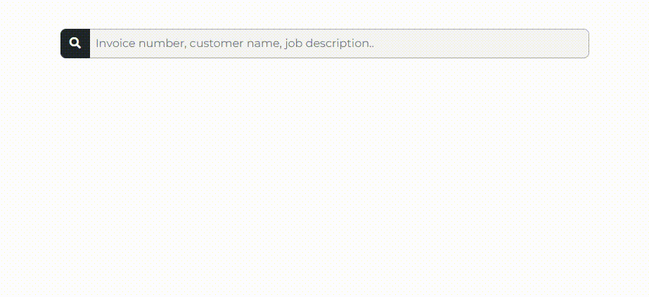

# Yii2 search
A simple search engine that allows the user to search for models by defined attributes and rules.


[](https://packagist.org/packages/kazda01/yii2-search)
[](https://packagist.org/packages/kazda01/yii2-search)



After specifying the rules, the user can search for multiple Models by multiple attributes at once. The results are then dynamically listed under the input.
For each search result, its IdentifyingString and the name of the attribute in which a match was found is displayed. The exact match is also highlighted in bold.

## Installation

The preferred way to install this extension is through [composer](http://getcomposer.org/download/).

```
composer require kazda01/yii2-search "@dev"
```

## Usage

### 1. Add Module and configure search parameters

After adding the project via composer, you need to add the SearchModule in the `web.php` modules and configure searching parameters.
If you want to have multiple different search engines (e.g. Invoice and User search engine), add the Module multiple times, ModuleID will be used for distinguishing.

The ModuleID will also be used to create the search route.
The final requests will go to `website.com/ModuleID/search?search=query`.
It is important to add the ModuleID to bootstrap so that the route is added to the UrlManager with priority over your site's routes (this action is not needed if your routes do not conflict with the search route).

```php
return [
    ...
    'bootstrap' => ['<ModuleID>'],
    'modules' => [
        '<ModuleID>' => [
            'class' => '\kazda01\search\SearchModule',
            'searchConfig' => [
                '<ModelSearch>' => [
                    'columns' => ['<ModelAttribute>', '<ModelAttribute>'],
                    'matchTitle' => '<matchTitle>',
                    'matchText' => function($model){
                        return 'Model: ' . $model->id;
                    }
                ],
            ]
        ],
    ],
    ...
];
```

All available settings are described here.

### 2. Add Search Model classes

Search Model classes must be generated. They can be simply made by [Gii CRUD generator](https://www.yiiframework.com/doc/guide/2.0/en/start-gii#generating-crud).
You can restrict what results certain users can search/display.

### 3. Generate search input

In a view, add this line. 

```php
<?= SearchInput::widget(['search_id' => 'main-search']); ?>
```

All available settings are described here.

## Options

### Module config

| option            | type                                                                                            | default value        | description                                                                                                          |
|-------------------|-------------------------------------------------------------------------------------------------|----------------------|----------------------------------------------------------------------------------------------------------------------|
| allowGet          | `boolean`                                                                                       | `false`              | Whether the search route (`/ModuleID/search`) should accept the GET method in addition to POST.                      |
| rules             | [Rules array](https://www.yiiframework.com/doc/api/2.0/yii-filters-accesscontrol#$rules-detail) | `[]`                 | Rules array as described by Yii docs. Can be used to restrict access to certain searches as shown in examples below. |
| searchResultClass | `string`                                                                                        | `'rounded'` | Class list of the search result.                                                                                  |
| searchConfig      | [searchConfig array](https://github.com/kazda01/yii2-search#search-config)                      | `[]`                 | Configuration of search fields - how to search the modules.                                                          |

### Search Config

| option      | type                                          | default value                                     | description                                                                                                                                                                                                 |
|-------------|-----------------------------------------------|---------------------------------------------------|-------------------------------------------------------------------------------------------------------------------------------------------------------------------------------------------------------------|
| columns     | `array[string]`                               | `[]`                                              | The columns/attributes in which the search engine should search for a match.                                                                                                                                |
| matchTitle     | `string\|function()`                               | None (required)                                              | Title/header that will be above results from this search_id. If you want to use Yii::t() function, pass a function that returns Yii2 translation function (see example at the bottom).                                                                                                                                |
| matchText     | `function($model)`                               | None (required)                                              | Text that will be displayed for every match. Should be some string that idetifies the found model.                                                                                                                                |
| route       | `string`                                      | `'<tablename>/view'`                             | Route to which the user should be directed after clicking.                                                                                                                                                  |
| routeParams | `function($model)` | Primary key | Route params to be used in `Url::toRoute([$route, $routeParams])`                                                                                                                                           |
| only_if     | `function($model)`                            | -                                                 | A function that receives a module as input, this record is only outputted in the results if this function returns true.                                                                                     |
| group_by    | `boolean\|string\|array[string]`              | `false`                                           | Whether to use GROUP BY clause to filter the same records. If true, the columns from `columns` will be used for GROUP BY. If it is a String or an array of Strings, those will be used as GROUP BY columns. |

### Input widget Config

| option        | default value                                     | description                                            |
|---------------|---------------------------------------------------|--------------------------------------------------------|
| search_id     | None (required)                                   | Used to identify which Search config to use.           |
| placeholder   | `'Search'`                                        | Input placeholder.                                     |
| formClass     | `''`                                              | Class list of the wrapper form.                        |
| buttonClass   | `'btn btn-dark search-button'`                    | Class list of the search button.                       |
| buttonContent | SVG of magnifying glass icon                      | Content of the search button.                          |
| inputClass    | `'form-control p-1 no-outline'`                   | Class list of the search input.                        |
| wrapperClass  | `''`                                              | Class list of the wrapper div.                         |
| widgetClass   | `'mx-auto shadow p-2 position-absolute bg-white'` | Class list of the widget div, generated by ajax call.  |

## Examples

### Example web.php

Search `invoice-search` allows all users to search 
- `Invoice` models by their `invoice_number` attribute

---

Search `main-search` allows logged in users to search
- `Invoice` models by their `invoice_number` attribute
- `InvoiceItem` models by their `description` attribute
- `Company` models by their `name`, `vat_id` and `state` attribute

By clicking on Invoice result, user gets redirected to Invoice detail page.

By clicking on InvoiceItem result, user gets redirected to the detail page of Invoice which has the item.

By clicking on Company result, user gets redirected to Invoice listing with set parameter in url to filter the Invoices by Company customer.

Company results are also grouped by `name`, `vat_id` and `state` attributes. They are also filtered by Companies, that are recorded as a Customer on any invoice, not supplier.


```php
return [
    ...
    'bootstrap' => ['main-search', 'invoice-search'],
    'modules' => [
        'main-search' => [
            'class' => '\kazda01\search\SearchModule',
            'allowGet' => true,
            'rules' => [
                [
                    'allow' => true,
                    'roles' => ['@'],
                    'actions' => ['index'], // allows only logged in users
                ],
            ],
            'searchConfig' => [
                'CompanySearch' => [
                    'columns' => ['name', 'vat_id', 'state'],
                    'matchTitle' => function(){
                        return Yii::t('app', 'Company')
                    },
                    'matchText' => function($model){
                        return $model->name . ', ' . $model->vat_id;
                    }
                    'route' => 'invoice/index',
                    'route_params' => function ($model) {
                        return ['InvoiceSearch[fk_company_customer]' => $model->name];
                    },
                    'only_if' => function ($model) {
                        return \app\models\Invoice::find()->where(['fk_company_customer' => $model->id])->count() > 0;
                    },
                    'group_by' => true,
                ],
                'InvoiceSearch' => [
                    'columns' => ['invoice_number'],
                    'matchTitle' => 'Invoice',
                    'matchText' => function($model){
                        return 'Invoice number ' . $model->invoice_number;
                    }
                ],
                'InvoiceItemSearch' => [
                    'columns' => ['description'],
                    'matchTitle' => 'Invoice item',
                    'matchText' => function($model){
                        return 'Invoice number: ' . $model->invoice->invoice_number;
                    }
                    'route' => 'invoice/view',
                    'route_params' => function ($model) {
                        return ['id' => $model->invoice->id];
                    }
                ],
            ]
        ],
        'invoice-search' => [
            'class' => '\kazda01\search\SearchModule',
            'searchConfig' => [
                'InvoiceSearch' => [
                    'columns' => ['invoice_number'],
                    'matchTitle' => 'Invoice',
                    'matchText' => function($model){
                        return 'Invoice number: ' . $model->invoice_number;
                    }
                ],
            ]
        ]
    ],
    ...
];
```

### Example view.php
```php
<div class="row g-0 justify-content-center">
    <?= SearchInput::widget([
        'search_id' => 'main-search',
        'placeholder' => Yii::t('app', 'Invoice number, customer name, job description..'),
        'wrapperClass' => 'col-11 col-lg-8 col-xl-7 mx-auto',
        'inputClass' => 'form-control p-2 no-outline',
    ]); ?>
</div>
```

## License

[MIT](https://choosealicense.com/licenses/mit/)

## Authors

- [@kazda01](https://www.github.com/kazda01)
- [@mifka01](https://www.github.com/mifka01)

## Tests

Every push to the repository triggers the CI test pipeline. You can run them locally by running these commands in the project root directory.

```bash
vendor/bin/phpstan analyse ./src
vendor/bin/phpcs ./src --extensions=php --colors --standard=PSR12 -n
vendor/bin/phpunit tests
```
